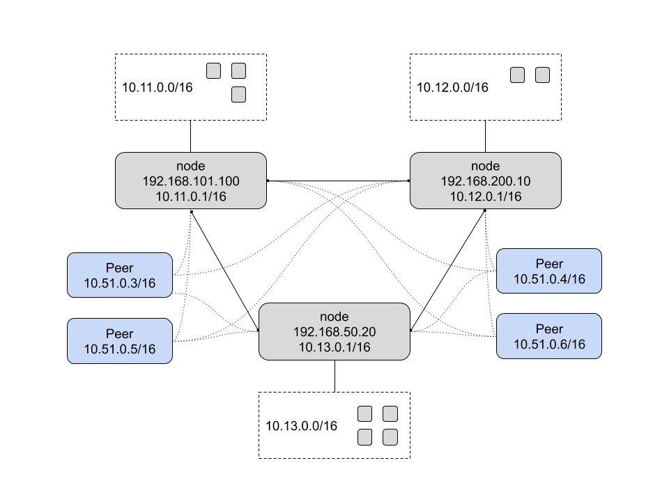

# Heimdall
Heimdall is a peer-to-peer private network system.  It uses [Wireguard](https://www.wireguard.com) for peer
communication and [Redis](https://redis.io) for backend storage.  All nodes are equal and the system
auto-elects in the event of a current master failure.  Non-node peers are also supported in which they
can only access the network but do not provide routing capabilities.



# Running
The easiest way to run Heimdall is with containers. It contains an embedded Redis that is configured
to be available only on the private network. In this example, we will use [Docker](https://docker.com):

## Server
Start a Heimdall server. The image contains everything needed:

```bash
docker run \
	-ti \
	--name heimdall \
	--cap-add NET_ADMIN \
	--cap-add SYS_MODULE \
	-v /lib/modules:/lib/modules:ro \
	--rm \
	ehazlett/heimdall:latest heimdall -D --name router
```

You should see the following:

```
DEBU[0000] starting redis on 16379
DEBU[0000] starting redis on 127.0.0.1 with port 16379 with path /var/lib/heimdall/redis.conf
DEBU[0001] starting grpc server                          addr="tcp://172.17.0.2:9000"
INFO[0001] starting heimdall                             commit=99b05636.m version=0.1.0
INFO[0001] starting as master id=81dfeb3e-08f3-5342-942e-05338da5b6ae name=router
DEBU[0001] starting master heartbeat
DEBU[0001] disabling replica status
DEBU[0001] generating new keypair for 81dfeb3e-08f3-5342-942e-05338da5b6ae
DEBU[0001] starting master heartbeat: ttl=5s
INFO[0001] cluster master key=b66920f5-0256-4694-9be9-1ab0ff8962d0
```

## Client
In order to connect a client, you will need to authorize a key. First we will generate a key to use:

```bash
$> uuidgen
9c76f92d-d55a-46c0-84d6-58c98144283
```

Next `docker exec` into the Heimdall server and authorize the peer key:

```bash
docker exec -ti heimdall hctl -a tcp://172.17.0.2:9000 peers authorize 9c76f92d-d55a-46c0-84d6-58c98144283
```

If you check the server logs you should see the following:

```
INFO[0022] authorized peer 9c76f92d-d55a-46c0-84d6-58c98144283
```

Next, start a Heimdal Peer connecting to the server using the previous key as the `id`:

```bash
docker run -ti \
	--cap-add NET_ADMIN \
	--rm \
	ehazlett/heimdall:latest \
	hpeer -D --name client --addr tcp://172.17.0.2:9000 --id 9c76f92d-d55a-46c0-84d6-58c98144283
```

Note: keys must be unique to the cluster or there will be communication errors.

You should see the following:

```
DEBU[0000] waiting for tcp://172.17.0.2:9000 to be reachable
INFO[0000] starting heimdall                             commit=99b05636.m version=0.1.0
INFO[0000] connecting to peer tcp://172.17.0.2:9000
DEBU[0000] syncing with node tcp://172.17.0.2:9000
DEBU[0000] updating peer config to version 9c37bb3df0e76105fc28982ef4da3e30ec4d7d2d7b27d0cfff0dbace802d3ee3
INFO[0000] restarting tunnel darknet
```

The peer is now connected to the server. To confirm the node is connected, exec into the client and ping
the server:

```
$> docker exec -ti <peer-container-id> ping router
PING router (10.11.0.1): 56 data bytes
64 bytes from 10.11.0.1: seq=0 ttl=64 time=0.068 ms
```

# Concepts
The following is the core design of Heimdall.

## Backend
[Redis](https://redis.io) is used to store network state.  It operates in a master/replica design for
fault tolerance and high availability.

## Security
Security and privacy are a core component of the network.  UUIDs are generated for nodes and peers
and both can use optional TLS to connect to the network.  All communication happens over Wireguard or minimal
management over the GRPC API.

For connectivity, you will need to configure firewalls to allow the GRPC port (default 9000) and the Endpoint
Port (Wireguard, default: 10100).

## Node
A Node is a machine in the network that operates as a gateway.  Nodes get a /16 by default to provide
network access to services.  Since all nodes are created equal, a pre-shared cluster key is used for access
when joining.  Upon joining, the node's Redis store is configured as a replica of the current master.
If the master goes away, an "oldest sibling" master election is performed.  The new master node's Redis
store is re-configured as the master and all other peer nodes are re-configured as replicas.

## Peer
There is also the ability for non-node peers to join.  These peers can access all services provided by the
gateway nodes but cannot provide routing or access themselves.  They are access only peers.  In order for
a peer to join, their peer ID must be authorized by an existing node.

## Routes
In the event that the node's /16 network space is not enough or wants to provide access to another subnet,
custom routes can be published.  This is done by publishing the route via the desired node ID.  All nodes
and peers will sync and re-configure their route tables accordingly.

## DNS
Heimdall has an embedded DNS server to enable private network access routing easier. By default, Heimdall
will use the local hostname as the network name, but you can override the name with the `--name` option
for both the server and peer.

# Local Setup
The following is a quick start to get Heimdall running.  This has only been tested on Alpine linux but
should be similar with other distros.

## Dependencies
The following need to be installed for Heimdall to operate properly:

Note: the `edge` repositories must be enabled to get the Wireguard packages.  Uncomment them from `/etc/apk/repositories`.

- `wireguard-vanilla` or `wireguard-virt` if using a VM
- `wireguard-tools`
- `iptables`
- `ip6tables`
- `redis` (optional)

This can be peformed with the following:

```bash
$> apk add -U wireguard-vanilla wireguard-tools iptables ip6tables redis
```

Note: make sure to reboot after installation so the kernel modules can be properly loaded.

Enable IP forwarding:

```bash
$> cat << EOF > /etc/sysctl.conf
net.ipv4.ip_forward = 1
EOF
```

# Redis
It is recommended to run a local Redis datastore on the node as all data is replicated.
It must be configured to bind (`bind 0.0.0.0`) on all interfaces so it can be accessed over the Wireguard
tunnel once Heimdall creates it.  Due to [Protected Mode](https://redis.io/topics/security)
in Redis it is recommended to use a password via the `requirepass` directive.

If using Alpine, you will also want to ensure Redis starts on boot:

```bash
$> rc-update add redis default
$> service redis start
```

## Build
Assuming you have a [Go](https://golang.org) toolchain configured you should be able to run `make` to get binaries.

## Releases
See the releases page for the latest pre-built binaries.
